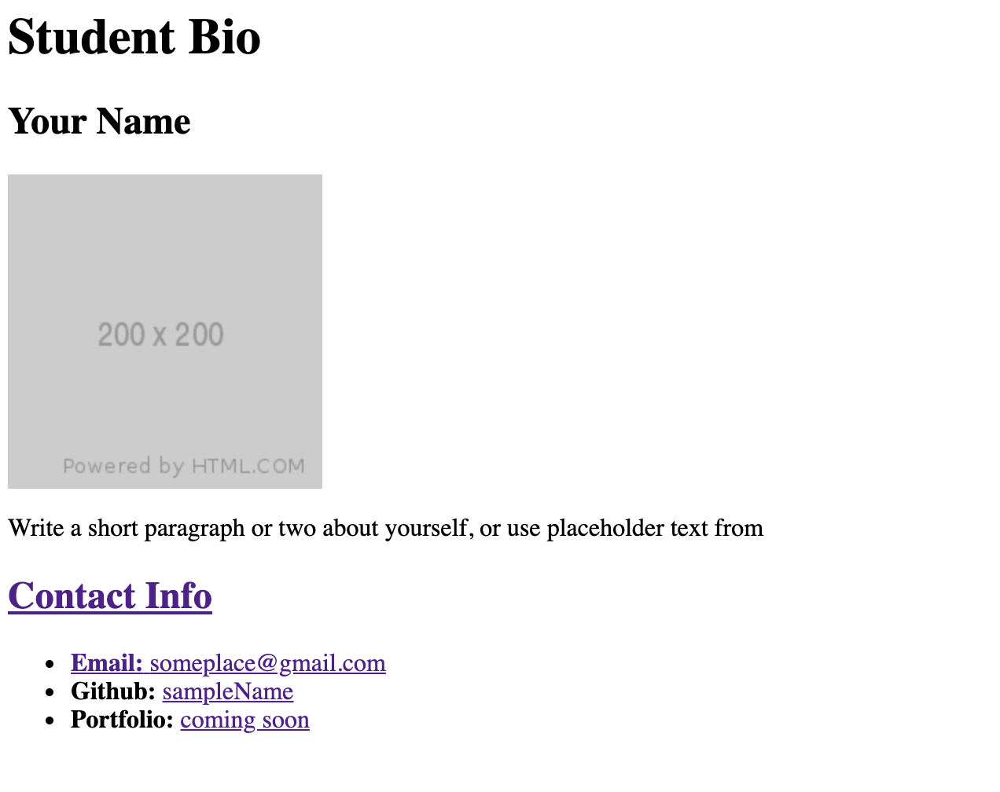

# HTML  :beginner:

We require you to solve the following task and place it in the **index.html** file. Remember to read the requirements first.

#### Topics you need to know and use to solve tasks

* HTML Attributes
* HTML Headings
* HTML Text Formatting 
* HTML Links - Hyperlinks
* HTML Images
* HTML Tables
* HTML Lists
* HTML Layout Elements
* HTML Form and inputs

**Final Notes**: *Remember to solve and send assignments on time* :hourglass_flowing_sand:

### Description

Create a simple html page that matches the image below

**Powered by [Tech Academy](https://www.tech.edu.az/)**
